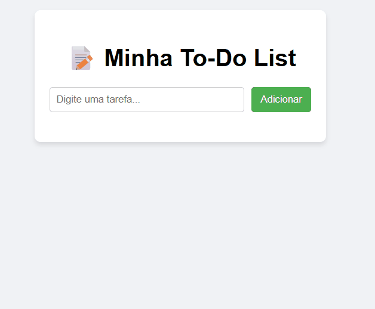

```markdown
# 📝 To-Do List in JavaScript

A simple task manager built with **HTML, CSS, and JavaScript**.  
Tasks are saved in the browser using `localStorage`.

---

## 🚀 How to Use

1. Clone this repository:
   ```bash
   git clone https://github.com/Lymm-08/to-do-list.git
   ```
2. Open the `index.html` file in your browser.
3. Add, complete, and delete tasks freely!

---

## 🎨 Features

- Add tasks  
- Mark tasks as completed  
- Delete tasks  
- Save tasks in the browser (localStorage)

---

## 📷 Demonstration



---

## 🌐 Online Access

[To-Do List on GitHub Pages](https://lymm-08.github.io/to-do-list/)
```
